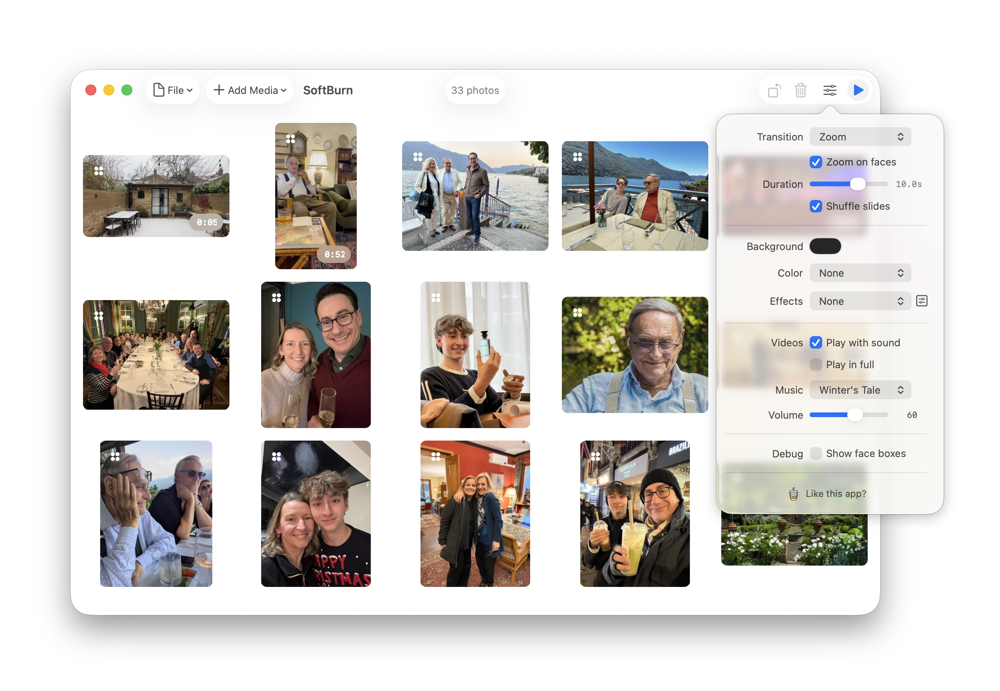
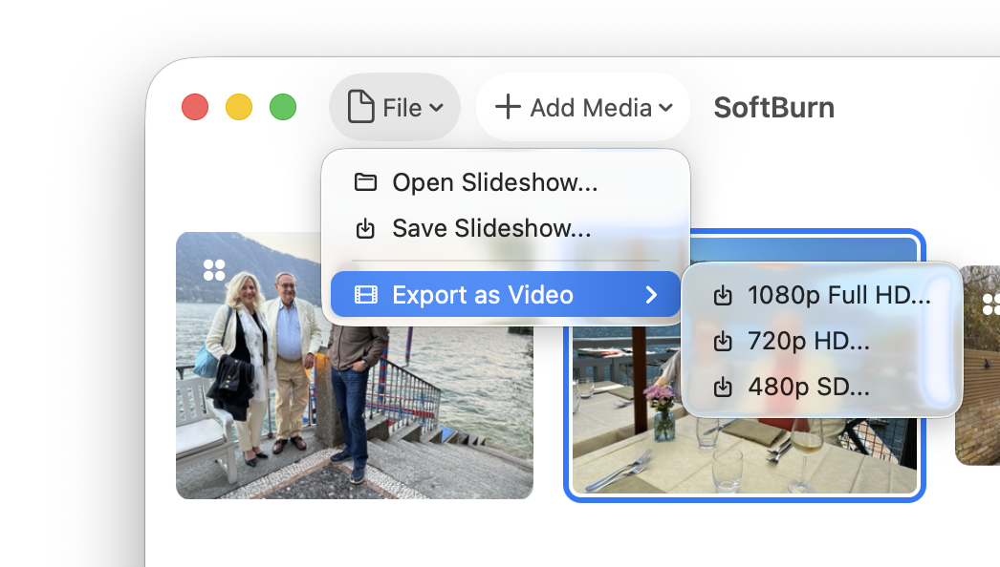

# SoftBurn

*A beautiful, free slideshow app for macOS that doesn't compromise on taste.*



## Why SoftBurn?

There are surprisingly few free, beautiful, and simple media slideshow apps for the Mac. Most options are either feature-bloated consumer software, legacy tools from the iPhoto era, or slideshow modes buried in photo managers that feel like afterthoughts.

**SoftBurn exists to solve this problem.** It's built on a simple philosophy: slideshows should be pretty by default, easy to create, and a joy to watch. Leveraging macOS's LiquidGlass design language and Metal-accelerated rendering, SoftBurn delivers a modern, tasteful slideshow experience that feels native to the platform.

It can also export slideshows as full HD videos.



## Features

- **Effortlessly Beautiful** - Intelligent face detection + Ken Burns effects make every slideshow dynamic without manual tweaking
- **Film Simulation** - GPU-accelerated analog effects (35mm film grain, aged patina, VHS artifacts) for authentic vintage aesthetics
- **Metal-Accelerated** - Two-pass rendering pipeline for real-time effects without compromising performance
- **LiquidGlass Design** - Modern macOS styling that embraces system design language (Tahoe+)
- **Smart Caching** - Prefetched face detection and lazy thumbnail generation keep the UI responsive
- **Versatile Media** - Photos, videos, and custom music support
- **Persistent Projects** - Save slideshows as `.softburn` files with all settings and metadata

## Technical Highlights

SoftBurn focuses on native macOS development:

- **Swift 6 Concurrency** - Strict actor isolation with background processing for heavy operations
- **SwiftUI + Metal 3** - Hybrid rendering strategy: SwiftUI for simple transitions, Metal for advanced effects
- **Vision Framework** - Face detection zoom automatically centers on subjects
- **Zero Dependencies** - Pure Apple frameworks (no external packages)
- **Sandboxed & Secure** - Security-scoped bookmarks enable cross-session file access

### Architecture at a Glance

```
UI Layer (SwiftUI)
  ↓
State Management (@MainActor)
  ↓
Conditional Rendering Path:
  • SwiftUI Path → Direct transitions + CPU effects
  • Metal Path → Two-pass GPU pipeline (scene + patina)
  ↓
Background Actors (Face Detection, Thumbnails, Caching)
```

See [CLAUDE.md](CLAUDE.md) for detailed architecture documentation.

## Getting Started

### Prerequisites

- macOS 14+ (Sonoma)
- Xcode 15+
- Swift 5.9+

### Building

```bash
# Clone the repository
git clone https://github.com/yourusername/SoftBurn.git
cd SoftBurn

# Open in Xcode (recommended)
open SoftBurn.xcodeproj

# Or build from command line
xcodebuild -project SoftBurn.xcodeproj -scheme SoftBurn -configuration Debug build
```

No external dependencies to install - all frameworks are built into macOS.

### Running

1. Build and run in Xcode (⌘R)
2. Import photos/videos via the + button or drag-and-drop
3. Adjust settings in the sidebar (transition style, duration, effects)
4. Hit Play to launch the slideshow in fullscreen

## Project Structure

SoftBurn uses a feature-based folder organization:

```
SoftBurn/
├── App/                    # Application lifecycle and entry point
├── Models/                 # Core data models (MediaItem, SlideshowDocument)
├── State/                  # State management (@MainActor observables)
├── Views/                  # SwiftUI/AppKit views organized by feature
│   ├── Main/              # Root app UI
│   ├── Grid/              # Photo grid and thumbnails
│   ├── Slideshow/         # Playback views
│   ├── Settings/          # Settings and tuning UI
│   ├── About/             # About and acknowledgements
│   ├── WindowControllers/ # Window management
│   └── Import/            # Import UI helpers
├── Rendering/             # Metal rendering pipeline and shaders
├── Video/                 # Video playback and pooling
├── Caching/               # Cache actors (faces, thumbnails, images)
├── Import/                # Media discovery and import logic
├── Audio/                 # Music playback
└── Utilities/             # Helpers and utilities
```

See [CLAUDE.md](CLAUDE.md) for detailed architecture documentation.

## Roadmap

- [x] Color filters (monocrome, sepia, siltertone)
- [x] Music playback
- [x] Single image preview
- [x] Image rotation
- [x] Enable Metal render pipeline.
  - [ ] Pre-load next video for performance
  - [ ] Unify Render pipelines (when 100% done)
  - [ ] Export to Video (only when unified)
- [x] Basic Multi-monitor support
  - [ ] Project on **all** monitors 
- [x] Photo App support
- [x] Tweak VHS and Aged Film
  - [x] Improve tearing
  - [x] Increase chromatic abberration
  - [x] Add brightness flashing to Aged Film
- [ ] Photo Album style (multi-photos dynamic templates)
- [ ] Localisation

## Contributing

Contributions are welcome! Please:

1. Read [CLAUDE.md](CLAUDE.md) for architecture guidance
2. Place feature specs in [/specs](/specs) before implementing
3. Follow Swift concurrency best practices (@MainActor isolation)
4. Test on multiple macOS versions if changing UI

## License

This project is licensed under the MIT License – see the [LICENSE](LICENSE) file for details.

## Privacy

SoftBurn does not collect, store, or share any personal data. See the [Privacy Policy](SoftBurn_Privacy_Policy.html) for details.